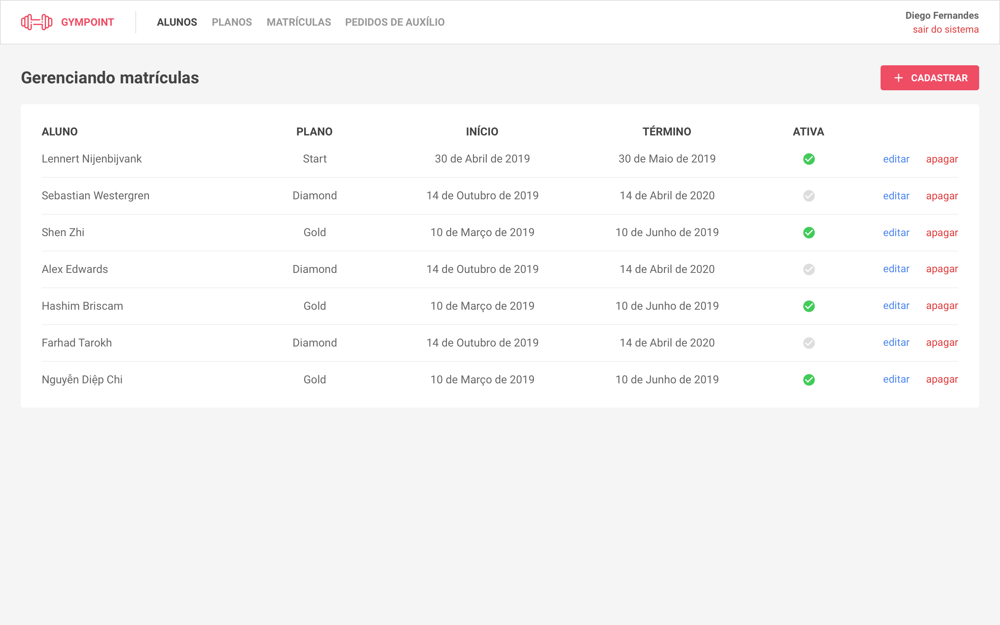
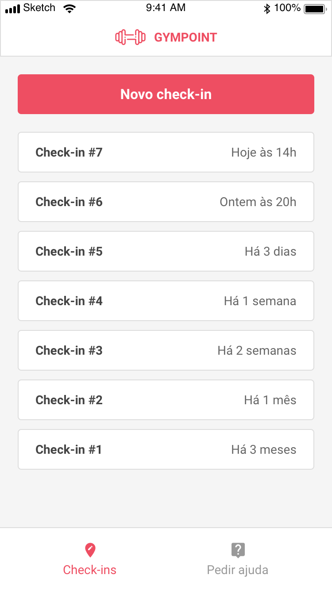

<h1 align="center">
  
</h1>
<h1 align="center">
  <a href="https://rocketseat.com.br/bootcamp">Desafio GoStack</a>
</h1>

## Sobre o projeto

Gympoint é um app que facilita o gerenciamento de matrículas de alunos em uma academia, a aplicação tem duas frente que são o administrativo e o mobile.

**Administrativo**: É um aplicação web com acesso restrito que faz todo o gerenciamento de alunos, matriculas, planos e o auxílio para alunos.
<h1 align="center">
  
</h1>

**Mobile**: O aplicativo mobile é para os alunos que estão matrículados na academia, neste aplicativo basicamente o aluno pode realizar check-ins e pedir auxílio.

<h1 align="center">
  
</h1>

## Requisitos
- [Docker](https://docs.docker.com/get-started/),
- [Yarn](https://yarnpkg.com/en/docs/install#debian-stable),
- [React Native](https://facebook.github.io/react-native/docs/getting-started) (Não foi utilizado o Expo no desenvolvimento)
- [Node v.10](https://nodejs.org/en/)

> **ATENÇÃO:** O app mobile foi testado apenas no Android (8.1) e pode ocorrer problemas em versões diferentes 

## Principais tecnologias utilizadas
- [React](https://pt-br.reactjs.org/)
- [React Native](https://facebook.github.io/react-native/)
- [Node](https://nodejs.org/en/)
- [Express](https://expressjs.com/pt-br/)
- [Mongo](https://www.mongodb.com/)
- [Mongoose](https://mongoosejs.com/)
- [Mysql](https://www.mysql.com/)
- [Sequelize](https://sequelize.org/)
- [Redis](https://redis.io/)
- [JWT](https://github.com/auth0/node-jsonwebtoken#readme)

## Instalação

### 1 Configuração de ambiente

- Copiar o arquivo **api/.env.example** para **api/.env** e configurar as variáveis de ambiente relacionadas ao serviço de e-mail(MAIL_USER, MAIL_PASS) e o [Sentry](https://sentry.io/welcome/)(SENTRY_DSN), o restante das variáveis não precisam ser alteradas.

- Copiar o arquivo **web/.env.example** para **web/.env**
- Copiar o arquivo **mobile/.env.example** para **mobile/.env**

> **IMPORTANTE:** Algumas configurações estão vinculadas com os serviços adicionados no **docker-compose.yml** então caso faça alguma alteração de porta ou endereço por exemplo é necessário alterar no docker-compose também.

### 2 Rodando a aplicação

- Para iniciar a aplicação é necessário apenas rodar o comando **docker-compose up** e aguardar a inicialização que pode demorar um pouco para baixar as imagens e instalar as dependências da **api** e **web**

### 3 Migrations
Após aguardar os serviços serem inicializados é preciso rodar as migrations e seeds da api que precisam ser feitas dentro do container:

-  **Migration:** docker exec -it **[CONTAINER_ID]** yarn sequelize db:migrate
-  **Seeds:** docker exec -it **[CONTAINER_ID]** yarn sequelize db:seed:all

> Para saber o **[CONTAINER_ID]** da api você pode rodar o comando **docker ps**

### 4 Acessando aplicação
  - Acessando a api diretamente[http://localhost:3333/plans](http://localhost:3333/plans) e se aparecer Unauthorized então a api está funcionando normalmente.
  - Acesse o link [http://localhost:3000/](http://localhost:3000/) e se aparecer uma tela de autenticação então a aplicação web está funcionando normalmente.

### 5 Mobile
Para rodar o mobile é preciso acessar a pasta **./mobile** e rodas os seguintes comandos: **yarn**,  **yarn start --reset-cache** e  **yarn android**, caso for ios rodar o comando **yarn ios**(lembrando que foram feitos testes apenas no android)

> **Importante:** Caso faça testes utilizando o USB é preciso rodar o comando: **adb reverse tcp:3333 tcp:3333 && yarn android** para que seja possível a comunicação com a API.